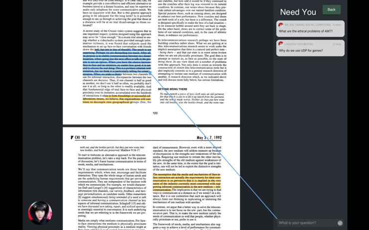
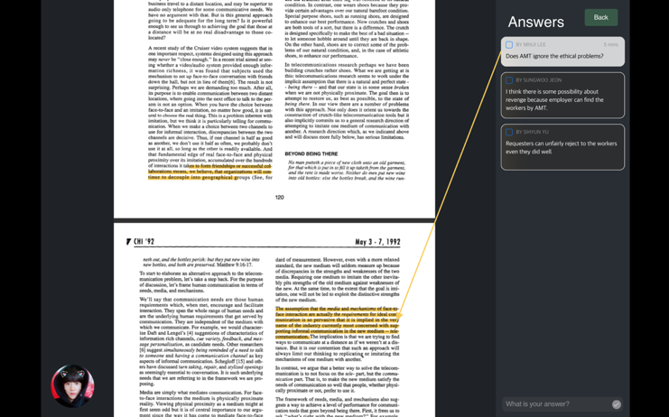
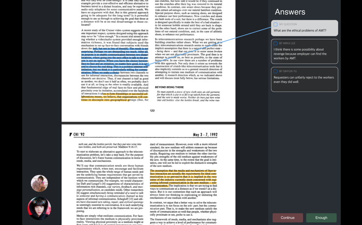
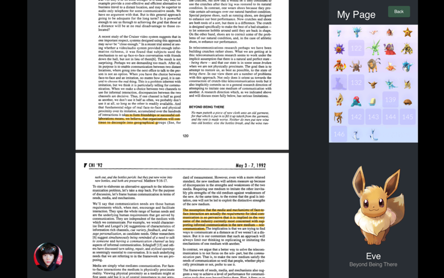
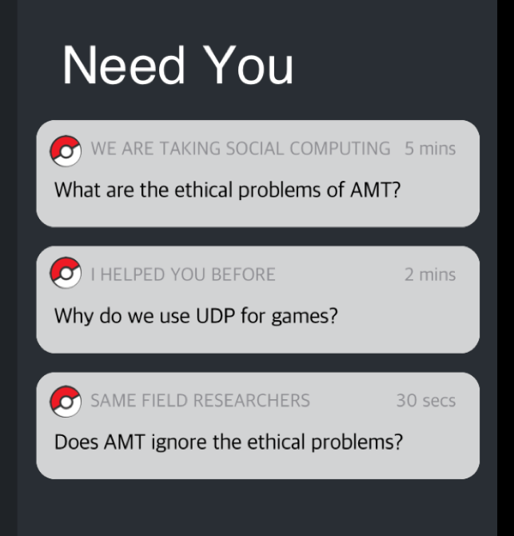

Minji Lee, Sihyun Yu, Juan Lee, Sungwoo Jeon
# To Gather
# Solution for Difficulties in Reading Academic Materials

## Problem statement
While reading academic materials, we encounter to difficulties to understand some concepts, vocabularies or intends of an author. These difficulties can be easily solved through discussion among people reading the same materials.  
However, unlike to questioner who has a strong motivation of curiosity, answerers are not clearly motivated by existing question-and-answer system.

## Tasks
Since we are willing to motivate answerers while discussing in reading materials via social computing, we have focused on social core functions rather than functions for implementing annotation.

### Our first social core function is Chain of Direct Questioning.
In most cases, we expect a questioner-oriented, kind, and detailed answer when we asked someone directly not to everyone. However, if we ask only one person, it could be low-quality or (s)he might not know the answer.  
Thus, we introduced the chain of direct questions. If someone asks a question, the question is delivered to a randomly chosen person. The person who got the question might feel responsibility since the question was only conveyed to him/her. After the answerer answers, the questioner can decide to confirm and finish the answering or to continue the answer chain. 

### Our second social core function is Common Point of Questioner and Answerer.
Even if the question is directly delivered to someone, it seems not enough to motivate answerer to answer the question. Unlike to privately question to friends, they do not know each other.  
We cannot make them as a real friend. However, we can find a common point of questioner and answer. We show the found common point to answerer, and this makes a stronger relationship between questioner and answerer. There can be many of examples, "I helped you before!", "We are taking the same course now!", "We both have the same interest in HCI," or "We are researchers in same field."

### The third social core function is Collecting Pokemon.
We expect people to think this platform is not an ordinary, boring QnA platform, but to think to feel the platform has some fun aspects like an online game.  
If answerer answers to the question, the answerer got randomly chosen Pokemon. This acts as a self-motivating factor for the answerer, and this would help people participate in our service. The more participation, the better chain of direct questioning is made because many people want to collect all Pokemon.

## Prototype

### Link to our prototype
[To-gather](https://invis.io/NTOSIH079RK#/327837398_Sign_IN) : https://invis.io/NTOSIH079RK#/327837398_Sign_IN

### Prototyping Tool
We used Sketch and Invision as a prototyping tool. We use these prototypes for a few reasons. First of all, they provided a familiar platform that we usually have used such as iOS UI or Android UI. Furthermore, the layer system was very similar to the one in Photoshop, so it was quite easy to get used of this platform. Also, the homepages offer detailed instructions for both program, so we can find how to do something whatever we want. Lastly, we are so fascinated the program visualizes hotspots very well between screen to screen.  
As mentioned, it was easy to organize the overall UI and make icons we want to create. However, some problems also occurred during our work. To begin with, making hotspots between the screen and screen was not an easy task. As we are adding hotspots in our workspace, it became more and more complicated, so we needed to consider a lot at the end of adding hotspots that we want. Plus, we tend to miss some hotspots even we thought it was finished, so we always need to double check it by executing the preview of our prototype.  
Lastly, synchronizing the project was one of the most challenging part or our prototype. We did all of our jobs in Sketch (including hotspots) and tried to sync it with Invision. We still don’t know the exact reason, but hotspots that we created in Sketch did not synchronize on Invision. Therefore, after a few tries, we needed to add the same hotspots In Invision again. 

### Representative Screenshots
  
To-gather is a platform that enables direct Q&A while reading materials.  

  
Requester’s question is passed to only one person, not available by all people. Answers would have more responsibility to answer the question, since the question if for you, not for all members. After answering at questions, it passes to another person again and again. (Task 1)  

  
Requesters can determine to continue passing the question to another person or to stop answering at his or her questions.  

  
If you answer at someone’s questions, you can collect the Pokemon that randomly given by each question. (Task 3)  

  
Rather than denoting the requester’s name, we show the common point between the questioner and answerers on answerer’s display.  (Task 2)  

### Design Choices
First of all, we will not support scrolling function and highlighting function on the pdf file for a few reasons. We think implementing many functions with pdf file is not an easy task and implementing this is not related to social interaction via computing. Instead, we will just add a simple function to switch the page in one file and shaping a square on the paper, not highlighting.  
Furthermore, we will not use much time on implementing register and uploading profile picture since this is not the point of social interaction that we want to focus on. For the test, we will give to random account and profile picture to test users. Therefore, to achieve task 1, we will get the information of the user in offline and add this information to accounts by our hands.  
Lastly, we will not implement any animations related to Pokemon, because our purpose is implementing collecting system in our UI, not making the sweet and cool Pokemon. 

### Instruction
Our prototype will show you an end-to-end scenario for our platform. Starting from sign-in, you can see profile page with Pokemon dictionary, questioning process as questioner, and answering process as answerer. User can see their own Pokemon, ask a question for incomprehensible part on textbook/paper, and also answer for these questions.
1. At [Sign-in](https://invis.io/NTOSIH079RK#/327837398_Sign_IN) page, please click green sign in button to start.
2. Click the profile button at the left downside. Then you can check the page for your collected Pokemon for answering at questions. (Task 3)
3. Click ‘Back’ button to return to the main screen.
4. Now, click the question button on the right, ‘Does AMT ignore the ethical problem?’. Then you can access the page to answer that question. You can check that the things that you and questioners share each other are denoted. (Task 1 & 2)
5. You can either select back button to return to the previous screen or click ‘What is your answer banner’ on the right below to answer at the question. (This time we assume that you already typed your answer. You don’t need to type any text. Just click it.)
6. You can check the answer added to the question. Now click back button to return. 
7. Now we are going to ask a question. Click the square on the left side on the paper. 
8. You will see that part is highlighted with the blue line. You can add a question to that part. Click ‘What is your question’ banner on the right below at the platform to add a question. (This time we also assume that you already typed your question. You don’t need to type any text. Just click it.)
9. You see your question is added to the screen on the upside right. If you see the left below, there are some icons of people with the circle shape. This is a notification to your questions. Click the icon with character to check the answer at your question.
10. Now, you can select Continue or Enough button. Continue button means you want to continue the question passing to others, and Enough button means you are now satisfied with answers.  If you select Continue, you just go back to the previous screen, or if you select Enough, you can check the answers are fixed.
11. After that, click back button to return to the main page. If you want to the question and answer again, you can click the highlighted part to move on that part.

## Observations
The criteria by which we have determined the difficulty:
* **HIGH**: The main functional problem of our UI. (pdf reader, QnA system)
* **MEDIUM**: a slightly more detailed problem compare to ‘high’. (not really related to our tasks but could be helpful.)
* **LOW**: a little relation with our task (Such as accessibility, etc)
  
We interviewed four people who have no background of our project. Note them as P1, P2, P3, and P4.  
We organized interview quetions and answers with difficulty criteria and theme(QnA, Visibility, Participation).

### HIGH
#### Theme. QnA
1. **By P3**. If the answer is not understandable, the questioner should be able to ask some additional questions.
* If the questioner couldn’t understand some of answers, (s)he can send a question message that contains whole contents of the previous one and add a question like ‘I can’t understand the ‘blabla’ question. What does that mean?’ so that making another question sequence.
2. **By P1**. Incorrect answers may be exposed. – Modifications should be possible.
* We can implement it but we also consider about trolling – modify it totally different for original question and answer. We need to restrict hard about modify access. Showing the warning message before posting the question or answer might help this issue, and this would be not very hard to implement in our high prototype.
3. **By P2**. We should care to avoid a sudden increase in the number of outstanding questions being raised.
* In passing question algorithm (which is our task 1), we can add the condition that we don’t send more question to the person who has more than the limit number of questions.
4. **By P4**. When I think I have enough answer to my question so I stopped it, but other person who has similar curious of that doesn’t think the answer is enough. It would be great if the other person can send the same que stion more again. 
* Since this service is crowdsourced-answering platform, it must be important to provide similar level of understanding to everyone. We carefully think the feedback, and it would be nice if we can implement some function to continue the cycle. It means, if someone feels unclear for finished answer, he/she can add additional question, and continue the cycle.

#### Theme. Participation
5. **By P3**. We need to make platform that people who understand everything (who don’t need to ask questions) also wants to access.
* Gathering people and increasing participation are the most important point in social communication. We already decided to make ‘pokemon’ system to induce active participation, so this should be attractive enough to gather people who don’t need to ask anything. If our ‘pokemon’ system is not enough, we must think another solution. But until now, this is our best plan.
6. **By P1, P2**. Benefits to respondents may not be sufficient compensation.
* (Same solution as #2 – if we can solve #2 problem, we can solve this #3, too.)

#### Theme. Visibility
7. **By P1**. When multiple questions are posted and you receive an alert, you will not know which questions are answered until you click on them, so you need to show them on alarm.
* We can denote the page number with the notification so that the user can predict what the question is. This will not a challenging part to implement, so we can add this feature in our high-fi prototype.

### MEDIUM
#### Theme. QnA
8. **By P3**. It would be nice to have an agreement because the platform needs many users.
* We need enough amount of people who can ask and reply together for good cycle. We can ask to KAIST courses that need this platform. – just like CS473. The more people who participate, the better quality for question cycle and answers. 
9. **By P2**. If you find a response you like, it would be nice to ask another question later to that person who reply the favorite answer.
* We can try to make a messenger function that people can ask a question personally. However, this is not an easy implementation. Individual asking is not a big task of our plan. Therefore we should consider more whether we should implement this or not.
10. **By P2, P4**. A reporting function is required for strange questions or answers. 
* Since the target users are students who share the same reading materials in class, lab, etc... , we expect trolling rarely happens, so we think we don’t need to care this issue so much in high-fi prototype.

#### Theme. Participation
11. **By P2**. It would be good to create a function to adopt answers and give bonuses to the owner of the answers adopted.
* We could implement a simple function to choose the best answer by clicking to the best answer before stop passing the answers. However, bonus for the answerer is not an easy problem. We will consider more about that while implementing high-fi prototype.

#### Theme. Visibility
12. **By P1**. Depending on the screen of the device that person uses, the space to read the pdf may be too small.
* We might  offer zoom in / zoom out function in pdf reader part or offer a function to control the size of pdf file. However, our focus is to offer a social interaction while reading the material via Q&A, so the screen size for reading material is not a very big issue. Therefore, we will try to implement mentioned functions if we have enough time after implementing core functions.
13. **By P4**. If there are too many highlight on pdf, it would be hard to read. We should make it clearly. 
* Although this seems a simple UI problem, not social problem, but it might violate social interactions if there are too much highlights which make people difficult to participate in the service. It would be nice if we make some function of summarizing, collecting, or hiding questions. This helps people not only to read clearly but also to organize the questions. Also, for High-fi prototyping, it would be okay not to implement this function because only small number of quetions are expected during high-fi testing period.

### LOW
#### Theme. QnA
14. **By P4**. Each answer is written in answerer’s individual ways, so it would be nice if the questioner can summarize them down after the reply is finished.
* We can implement the summary function for questioner with seeing the above answers added, but we have to consider the possibilities of questioners’ trolling to remove or modify proper answers. Therefore, we need additional function that questioner can’t modify the previous answers. However, we don’t think just summarize answers with his/her words cannot increase the interaction with other people. We should consider whether implement this or not.

#### Theme. Participation
15. **By P2**. It would be fun to make mini games where users can fight with Pokemon. Let the winner of the duel get a chance to ask questions.
* Making a mini game is a good option to increase the participation, but, because of time and technical issues, it would be hard to implement the game for our UI. Just focusing more on our 3 tasks may enoughly increase the interaction between people who are reading the same materials.